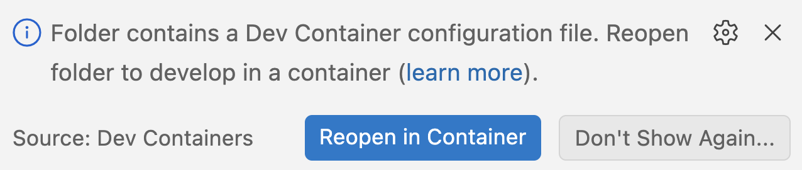
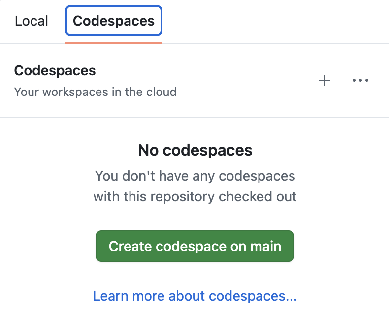

# CAP Node.js development environment

A handy repo containing a [development container](https://containers.dev/)
definition for use with VS Code or GitHub Codespaces. The definition describes
the tool setup for developing with SAP Cloud Application Programming Model
(CAP) Node.js:

- A Node.js environment
- The CDS development kit (`@sap/cds-dk`)
- The Cloud Foundry CLI
- Various common command line tools

## Setup

You can of course follow the [Getting
Started](https://cap.cloud.sap/docs/get-started) guide in Capire, and install
the required runtime and tools directly on your own machine.

Alternatively, you can use the development container definition in this repo.
The advantage of using the development container definition is that you don't
need to commit to installing extra tools and runtimes on your own machine, you
can isolate and abstract that via containers, either running in a container
engine locally, or in the cloud.

There are two main ways to proceed - with VS Code on your own machine, or with
GitHub Codespaces.

### Using VS Code

If you have VS Code installed, and a container manager such as Docker Desktop
or Podman:

- ensure you have the [Dev
  Containers](https://marketplace.visualstudio.com/items?itemName=ms-vscode-remote.remote-containers)
  extension installed
- clone this repo
- open the directory in VS Code

At this point, thanks to the extension, you will be asked if you want to
"reopen in container":

Once you do that, you're all set.

### Using GitHub Codespaces

If you have a GitHub account (it can be a free one), you can simply use the "Code"
button on this repo's page, and create a Codespace based upon it:

Once a Codespace is launched, you'll find yourself in a VS Code based environment
in the cloud, hosted by GitHub.

> [!TIP] GitHub [Codespaces](https://docs.github.com/en/codespaces) start to
> incur storage charges after a certain amount of time. Be sure to manage your
> Codespaces appropriately to avoid unncessary fees. See the [GitHub Codespaces
> billing](https://docs.github.com/en/billing/concepts/product-billing/github-codespaces)
> page, which also has information on the free quotas.

## License

Copyright (c) 2026 SAP SE or an SAP affiliate company. All rights reserved.
This project is licensed under the Apache Software License, version 2.0 except
as noted otherwise in the [LICENSE](LICENSE) file.
